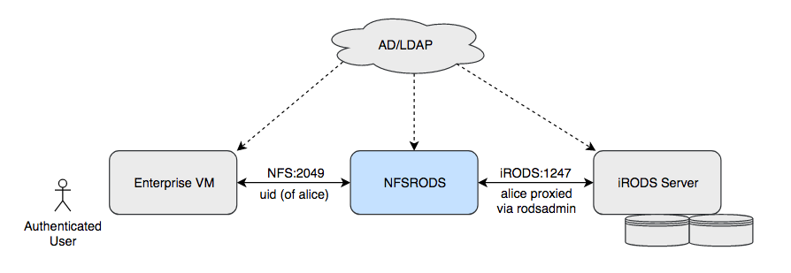
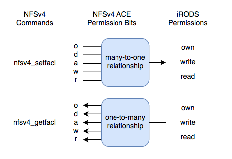

# NFSRODS
A standalone NFSv4.1 server (via [nfs4j](https://github.com/dCache/nfs4j)) with a Virtual File System implementation supporting the [iRODS Data Management Platform](https://irods.org).



## Table of Contents
- [Features](#features)
- [Requirements](#requirements)
- [General Information](#general-information)
  + [Building](#building)
  + [Configuring](#configuring)
  + [Running](#running)
  + [Mounting](#mounting)
- [Unix Permissions and NFSv4 ACLs](#unix-permissions-and-nfsv4-acls)
  + [Using nfs4_setfacl](#using-nfs4_setfacl)
  + [Using nfs4_getfacl](#using-nfs4_getfacl)
  + [nfs4_setfacl Whitelist](#nfs4_setfacl-whitelist)
- [TODOs](#todos)
- [Notes](#notes)
- [Troubleshooting](#troubleshooting)

## Features
- Configurable
- Exposes iRODS through a mount point
- Clients avoid the need for learning icommands
- Clients avoid the need to install additional iRODS packages
- Supports many common *nix commands and software (e.g. mkdir, cat, etc.)

## Requirements
- iRODS v4.2.6+
- [iRODS REP for Collection Mtime](https://github.com/irods/irods_rule_engine_plugin_update_collection_mtime)
- Docker (as of this writing, v18.09.0)
- OS NFS packages (e.g. Ubuntu 16.04: nfs-common)

## General Information
The following instructions assume you're running Ubuntu 16.04 and Bash.

### Building
```bash
$ cd /path/to/irods_client_nfsrods
$ docker build -t nfsrods .
```

### Configuring
There are three config files located under `/path/to/irods_client_nfsrods/irods-vfs-impl/config`:
- exports
- log4j.properties
- server.json

The first step in configuring the server is to copy these files into another location on disk like so:
```bash
$ mkdir ~/nfsrods_config
$ cp /path/to/irods_client_nfsrods/irods-vfs-impl/config/* ~/nfsrods_config
```
These files will be mounted into the NFSRODS docker container. This will be discussed later.

#### Configuration File: exports
At this time, this file should not be modified. Administrators are expected to limit access to the mount point through other means.

#### Configuration File: log4j.properties
NFSRODS uses [Log4j 2](https://logging.apache.org/log4j/2.x/) for managing and writing log files. The default config will log messages with a level >= `WARN` to `stdout`. Configuring Log4j is out of scope for this documentation.

#### Configuration File: server.json
You'll need to set each option to match your iRODS environment. Each option is explained below.
```javascript
{
    // This section defines options for the NFSRODS NFS server.
    "nfs_server": {
        // The port number within the container to listen for NFS requests.
        "port": 2049,
        
        // The path within iRODS that will represent the root collection.
        // We recommend setting this to the zone. Using the zone as the root
        // collection allows all clients to access shared collections and data
        // objects outside of their home collection.
        "irods_mount_point": "/tempZone",

        // The refresh time for cached user information.
        "user_information_refresh_time_in_milliseconds": 3600000,

        // The refresh time for cached stat information.
        "file_information_refresh_time_in_milliseconds": 1000

        // The refresh time for cached user access information.
        "user_access_refresh_time_in_milliseconds": 1000
    },

    // This section defines the location of the iRODS server being presented
    // by NFSRODS. The NFSRODS server can only be configured to present a single iRODS zone.
    "irods_client": {
        "host": "hostname",
        "port": 1247,
        "zone": "tempZone",
        
        // Defines the target resource for new data objects.
        "default_resource": "demoResc",

        // Enables/disables SSL/TLS between NFSRODS and the iRODS server.
        //
        // The following options are available:
        // - CS_NEG_REQUIRE: Only use SSL/TLS.
        // - CS_NEG_DONT_CARE: Use SSL/TLS if the iRODS server is not set to CS_NEG_REFUSE.
        // - CS_NEG_REFUSE: Do NOT use SSL/TLS.
        //
        // NOTE: NFSRODS does not yet support SSL/TLS.
        "ssl_negotiation_policy": "CS_NEG_REFUSE",
        
        // The total amount of time before an idle connection times out.
        // Defaults to 600 seconds.
        "connection_timeout_in_seconds": 600,

        // An administrative iRODS account is required to carry out each request.
        // The account specified here is used as a proxy to connect to the iRODS
        // server for some administrative actions. iRODS will still apply policies
        // based on the requesting user's account, not the proxy admin account.
        "proxy_admin_account": {
            "username": "rods",
            "password": "rods"
        }
    }
}
```

### Running
After updating the config file, you should be able to run the server using the following commands:
```bash
$ docker run -d --name nfsrods \
             -p <public_port>:2049 \
             -v </full/path/to/nfsrods_config>:/nfsrods_config:ro \
             -v </full/path/to/etc/passwd/formatted/file>:/etc/passwd:ro \
             nfsrods
```

This command does the following:
- Launches the container as a daemon
- Names the container **nfsrods**
- Exposes NFSRODS via the port `<public_port>`
- Maps the local config directory into the container as read-only.
- Maps the local `/etc/passwd` formatted file into the container as read-only.

**IMPORTANT:** `/etc/passwd` is expected to contain all of the users planning to use NFSRODS. The users defined in this file **MUST** be defined in iRODS as well. Their usernames must match the names defined in this file exactly as this is how NFSRODS matches users to the correct account in iRODS.

If you want to see the output of the server, run the following command:
```bash
$ docker logs -f nfsrods
```
This only works if the logging has been configured to write to stdout.

On startup, the NFSRODS server logs the build information (time, version, and git-SHA). You can get this information at any time by executing the following command:
```bash
$ docker run --rm nfsrods sha
```

### Mounting
```bash
$ sudo mkdir <mount_point>
$ sudo mount -o sec=sys,port=<public_port> <hostname>:/ <mount_point>
```

If you do not receive any errors after mounting, then you should be able to access the mount point like so:
```bash
$ cd <mount_point>/path/to/collection_or_data_object
```

#### Things To Consider
Depending on your environment and deployment of NFSRODS, you may want to consider passing `lookupcache=none` to the mount command. This instructs the kernel to NOT cache directory entries which forces NFSRODS to lookup information about a directory on every request. While doing this will make NFSRODS less responsive, the benefit is that NFSRODS is less likely to leak information between users if they are operating within the same directory.

## Unix Permissions and NFSv4 ACLs
In iRODS, multiple users and groups can be given different permissions on a collection or data object. Unix does not provide this capability and therefore, iRODS permissions cannot be mapped into Unix permissions without losing information. To get around this, NFSRODS uses NFSv4 ACLs.



NFSv4 ACLs provide more than enough control for reflecting iRODS permissions in Unix. To manage permissions through NFSRODS, you'll need to install the package that contains `nfs4_getfacl` and `nfs4_setfacl`. On Ubuntu 16.04, that package would be `nfs4-acl-tools`. With these commands, you can view and modify all permissions in iRODS.

**IMPORTANT:** The order of ACEs within an ACL does not matter in NFSRODS. When NFSRODS has to decide whether a user is allowed to execute an operation, it takes the highest level of permission for that user (including groups the user is a member of).

### Using nfs4_setfacl
When using `nfs4_setfacl`, it's important to remember the following:
- Domain names within the user and group name field are ignored.
- Special ACE user/group names (e.g. OWNER, GROUP, EVERYONE, etc.) are not supported.
- Unsupported permission bits are ignored.
- The highest permission level provided is what NFSRODS will set as the permission.

Below is the permissions translation table used by NFSRODS when `nfs4_setfacl` is invoked. The list is in descending order of iRODS permissions.

| NFSv4 ACE <br/> Permission Bit | NFSv4 ACE <br/> Permission Bit Name | iRODS <br/> Permission |
|:-------------------:|:------------------------:|:-----------:|
| o                   | ACE4_WRITE_OWNER         | own         |
| a                   | ACE4_APPEND_DATA         | write       |
| w                   | ACE4_WRITE_DATA          | write       |
| r                   | ACE4_READ_DATA           | read        |

#### Example
Given the following:
```bash
$ nfs4_setfacl -a A::john@:ro foo.txt
```
NFSRODS will see that the **ACE4_READ_DATA** and **ACE4_WRITE_OWNER** bits are set. It then maps these to appropriate iRODS permissions and takes the max of those. NFSRODS will then set `john`'s permission on `foo.txt` to `own`.

### Using nfs4_getfacl
Using this command is much simpler. When invoked, it returns the list of iRODS permissions on an object as an ACL. The mapping used for translation is shown below.

| iRODS <br /> Permission | NFSv4 ACE <br/> Permission Bits |
|:-----------:|:--------------------:|
| own         | rwado                |
| write       | rwa                  |
| read        | r                    |

### nfs4_setfacl Whitelist
NFSRODS offers a whitelist for granting `nfs4_setfacl` permission to particular users.

If a user is in the whitelist or in a group in the whitelist, they can run `nfs4_setfacl` on the specified logical path or any collection or data object **below** it, regardless of their iRODS permissions on that collection or data object.

A `rodsadmin` can add a user to the whitelist by adding a specific iRODS AVU (metadata) on the user.
```bash
$ imeta add -u <username> irods::nfsrods::grant_nfs4_setfacl <logical_path_prefix>
```
The following example demonstrates adding `alice#tempZone` to the whitelist with a prefix of `/tempZone/project_a/lab/notes`:
```bash
$ imeta add -u alice irods::nfsrods::grant_nfs4_setfacl /tempZone/project_a/lab/notes
$ imeta ls -u alice
AVUs defined for user alice#tempZone:
attribute: irods::nfsrods::grant_nfs4_setfacl
value: /tempZone/project_a/lab/notes
units:
```

A user can set permissions via `nfs4_setfacl` on a collection or data object if any of the following are true:
1. The user is an iRODS administrator (i.e. `rodsadmin`).
2. The user has `own` permission on the collection or data object.
3. The user is a member of a group that has `own` permission on the collection or data object.
4. The user is in the whitelist with a prefix that covers the collection or data object.
5. The user is a member of a group in the whitelist with a prefix that covers the collection or data object.

### Additional NFSv4 Information
- [RFC 7530](https://tools.ietf.org/html/rfc7530)
- [HOWTO: Use NFSv4 ACL](https://www.osc.edu/book/export/html/4523)

## TODOs
- Implement support for SSL connections to iRODS
- Implement support for Parallel File Transfers

## Notes
- `chmod` is currently implemented as a `NOP` and will return `0`.

## Troubleshooting
### Q. The NFSRODS docker container won't start. Why?
It is likely that your `server.json` configuration is incorrect. To verify this, try running the container using `-it` instead of `-d` like so:
```bash
$ docker run -it --name nfsrods \
             -p <public_port>:2049 \
             -v </full/path/to/nfsrods_config>:/nfsrods_config:ro \
             -v </full/path/to/etc/passwd/formatted/file>:/etc/passwd:ro \
             nfsrods
```
This command will cause the log messages to appear in your terminal. If there are any errors during start-up, they will appear in the output. Missing configuration options will have a prefix of **Missing server configuration option**.
